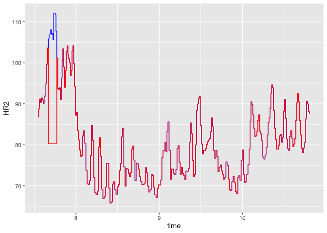
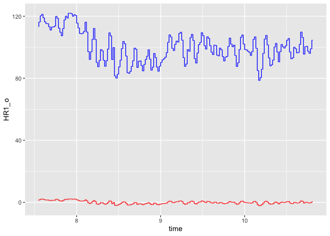

Assignment 4 - Heart rate, respiration and interpersonal coordination
=====================================================================

Physiological data (here heart rate \[variability\], and respiration) are increasingly popular. Historically treated as pernicious noise to be regressed out of neuro-imaging data, there is now increasing research on how these signals tell us something important about cognition and beyond being just a signal of cognitive processes also impact them in interesting ways. Advanced sport science, and the quantified self movement (closely followed by marketing and communication) have hailed continuous physiological tracking as a powerful way to access and modify attitudes, habits, and performance. Further, as team coordination (in the military, in decision processes and organizational contexts) is more and more in focus, research has attempted to measure how interpersonal coordination between physiological systems might tell us something important about e.g. emotional and cognitive coordination. See references in the reading list for more on this.

In this assignment, you will learn to: - collect physiological data - pre-process physiological data (and grow further your mad R skills) - model the continuous interdependence between two signals (using a multilevel model as proxy for a dynamical system approach) - conservatively assess the presence of coordination between to signals in a controlled context

This assignment has two parts. The first part familiarizes you with heart rate, and respiration data and their preprocessing. The second part explores how to analyze interpersonal coordination of these signals.

These are the questions you need to be able to answer at the end of the assignment (aka that you need to submit as part of the portfolio)

1.  How do you preprocess heart rate and respiration data? Describe the process. If any data needs to be excluded, list the excluded data and motivate the exclusion.

2.  Do you observe interpersonal coordination in heart rate and respiration? Describe your control baseline, the method used to quantify coordination, and the statistical models used to infer whether coordination was higher than in the baseline. Report the results of the models.

3.  Do you observe differences in coordination between conditions? Report the models and results.

4.  Is respiration coordination a likely driver of heart rate coordination? Describe how you would test for it. Bonus points if you actually run the tests and report methods and results.

N.B. to give you a bit more data I included data from previous years (Study1, Study2 and Study 3). Note that synchronouns and turn-taking are the same across both studies, but the third condition is different: in the first year it was self-paced joint reading; in the second year it was the tv-series conversation.

Let's get started
-----------------

### Exploring physiological signals

-   Choose one pair (one pair, three conditions)
-   Load the logs
-   Produce a plot of the participants' respiration signal and a different one of the participants' HR signal. N.B: remember the slides: artifacts, downsampling, scaling. N.B. The gridExtra::grid.arrange() function allows you to display the plots side by side. E.g. grid.arrange(plot1, plot2, plot3, ncol=3). There are also smarter packages, like cowplot and ggpubr.
-   Can you eye-ball which condition if any displays more physiological coordination?

### First we read one data file and identify the procedure

-   Load the file
-   correctly identify all columns
-   plot the data
-   deal with the artifacts
-   downsample the dat
-   Add a column for study, group, trial and condition

``` r
#LOAD LIBRARIES
library(tidyverse, lme4)
```

    ## ── Attaching packages ─────────────────────────────────────────────────────────────────────────────────────────────────────────────────────── tidyverse 1.2.1 ──

    ## ✔ ggplot2 3.2.1     ✔ purrr   0.3.2
    ## ✔ tibble  2.1.3     ✔ dplyr   0.8.3
    ## ✔ tidyr   0.8.3     ✔ stringr 1.4.0
    ## ✔ readr   1.3.1     ✔ forcats 0.4.0

    ## ── Conflicts ────────────────────────────────────────────────────────────────────────────────────────────────────────────────────────── tidyverse_conflicts() ──
    ## ✖ dplyr::filter() masks stats::filter()
    ## ✖ dplyr::lag()    masks stats::lag()

``` r
pacman::p_load(lmerTest, simr, DescTools, goeveg, sjstats, effsize, ggplot2, dplyr, groupdata2, stringr, caret, tidyr)

#LOAD EXAMPLE FILE 
##tried differt ones to see the measures in the different studies
file <- read.csv("Study3_G1_T3_Conversation.csv")
file <- read.csv("Study4_G5_T4_MovementGuided.csv")
file <- read.csv("Study2_G7_T1_Conversation.csv")
file <- read.csv("Study1_G3_T1_SelfPaced.csv")

#PLOT
##hearrate
ggplot(file) + 
    geom_path(aes(x = time, y = HR1), colour = "blue") + 
    geom_path(aes(x = time, y = HR2), colour = "red") + 
    labs(x = "Time", y = "Heartrate") 
```


``` r
##respariation 
ggplot(file) + 
  geom_line(aes(x = time, y = Resp1), colour = "blue" ) + 
  geom_line(aes(x = time, y = Resp2), colour = "red")
```


``` r
#REMOVE OUTLIERS
##Ricardo's function: bad, becasue we know the data is not independent, we know the mean is not the best guess 
##If you choose to model: assumption the model is so extreme, that it is an error, therefore we assume it is a missing data point, so we guess it 
##If you choose threshold of 2sd: we think it's an extreme outlier, so we'll pull it closer to the mean 
##Can also assume that it is between the point before and after (the mean of the two) 
##Can also just take point before 

##Ricardo's function 
threshold=2.5 # Default value at 2.5 sds from the mean
removeOuts <- function(ts,threshold){
  ts[ts > (mean(ts,na.rm=T) +
             (threshold*sd(ts,na.rm=T))) | 
       ts < (mean(ts,na.rm=T) -
             (threshold*sd(ts,na.rm=T)))] = mean(ts,na.rm=T)
  return(ts)
}

##remove outliers with function
file$Resp1_o <- removeOuts(file$Resp1, threshold)
file$Resp2_o <- removeOuts(file$Resp2, threshold)
file$HR1_o <- removeOuts(file$HR1, threshold)
file$HR2_o <- removeOuts(file$HR2, threshold)

##plot raw against outlier-removed data
ggplot(file) + 
    geom_line(aes(x = time, y = HR1), colour = "lightblue") + 
    geom_line(aes(x = time, y = HR1_o), colour = "blue") + 
    geom_line(aes(x = time, y = HR2), colour = "pink") + 
    geom_line(aes(x = time, y = HR2_o), colour = "red") + 
    labs(y = "Heartrate", x = "Time")
```


``` r
ggplot(file, aes(x = time, y = HR2)) + 
    geom_line(aes(x = time, y = HR2), colour = "blue") + 
    geom_line(aes(x = time, y = HR2_o), colour = "red")
```



``` r
ggplot(file, aes(x = time, y = Resp1)) + 
    geom_line(aes(x = time, y = Resp1), colour = "blue") + 
    geom_line(aes(x = time, y = Resp1_o), colour = "red")
```


``` r
ggplot(file, aes(x = time, y = Resp2)) + 
    geom_line(aes(x = time, y = Resp2), colour = "blue") + 
    geom_line(aes(x = time, y = Resp2_o), colour = "red")
```


``` r
#SCALE
##Tip: if scale() gives some issues, try the one below
##z_scale <- function(column){
#column_c <- (column - mean(column)) / sd(column)
#}

file$Resp1_s <- scale(file$Resp1_o)
file$Resp2_s <- scale(file$Resp2_o)
file$HR1_s <- scale(file$HR1_o)
file$HR2_s <- scale(file$HR2_o)

##plot outlier-removed against scaled data
ggplot(file) + 
    geom_line(aes(x = time, y = HR2_o), colour = "pink") + 
    geom_line(aes(x = time, y = HR2_s), colour = "red") + 
    geom_line(aes(x = time, y = HR1_o), colour = "lightblue") + 
    geom_line(aes(x = time, y = HR1_s), colour = "blue") + 
    labs(y = "Heartrate", x = "Time")
```


``` r
ggplot(file) + 
    geom_line(aes(x = time, y = HR1_o), colour = "blue") + 
    geom_line(aes(x = time, y = HR1_s), colour = "red")
```



``` r
ggplot(file) + 
    geom_line(aes(x = time, y = Resp1_o), colour = "blue") + 
    geom_line(aes(x = time, y = Resp1_s), colour = "red")
```


``` r
ggplot(file) + 
    geom_line(aes(x = time, y = Resp2_o), colour = "blue") + 
    geom_line(aes(x = time, y = Resp2_s), colour = "red")
```


``` r
#DOWNSAMPLE
##This is tricky, so you can have a look at my code  (relying on Ludvig's groupdata2) if you get stuck
#d1 = d %>%
#  group(n = 100, method = 'greedy') %>%
#  dplyr::summarise(
#    time = mean(time,na.rm=T),
#    HR1 = mean(HR1S,na.rm=T),
#    HR2 = mean(HR2S,na.rm=T),
#    Resp1 = mean(Resp1S,na.rm=T),
#    Resp2 = mean(Resp2S,na.rm=T),
#    rowname = rowname[1]) #the index we use to put them back together 

file1 = file %>%
  group(n = 1000, method = 'greedy') %>%
  dplyr::summarise(
    time = mean(time,na.rm=T),
    HR1 = mean(HR1_s,na.rm=T),
    HR2 = mean(HR2_s,na.rm=T),
    Resp1 = mean(Resp1_s,na.rm=T),
    Resp2 = mean(Resp2_s,na.rm=T)) #the index we use to put them back together 

##plot downsampled data
ggplot(data = file1) +
  geom_line(aes(time, HR1, color = "blue")) +
  geom_line(aes(time, HR2, color = "red")) +
  labs(x = "Time", y = "Heartrate") +
  theme(legend.position = "none")
```


``` r
#ADD GROUP, TRIAL, CONDITION to the cleaned up, scaled, downsampled data
##Tip the info is in the file name
filename <- "Study3_G1_T3_Conversation.csv"
string <- str_split(filename, "_", simplify = T)
file1$study <- str_extract(string[1,1], "\\d+")
file1$group <- str_extract(string[1,2], "\\d+")
file1$trial <- str_extract(string[1,3], "\\d+")
file1$condition <- str_extract(string[1,4], ".+?(?=.csv)")
```

Now we are ready to go to load and pre-process all files
--------------------------------------------------------

Go through all the files (with a function passed onto map\_df), check which files should be excluded, if any, and save the pre-processed time-series

A couple of tips: - looping is oh so slow. Making a function and using Map/Map\_df is your salvation. - each study restarts the group numbering, so you should make sure to change that (e.g. 100 \* Study + Group) - you need to make sure all the data are meaningful or something has to be removed. Plotting is your friend. E.g. "Study1\_G1\_T1\_Synchronous" has one bad respiration signal. We could replace it with NAs

``` r
#Define a function running the loading, artifact removal, scaling, downsampling, info adding.

#FUNCTION FOR STUDY 1 AND 2
data_preprocess12 <- function(filename, threshold = 2.5){
  #load file
  file <- read.csv(filename)
  #remove outliers
  file$Resp1_o <- removeOuts(file$Resp1, threshold)
  file$Resp2_o <- removeOuts(file$Resp2, threshold)
  file$HR1_o <- removeOuts(file$HR1, threshold)
  file$HR2_o <- removeOuts(file$HR2, threshold)
  #scale
  file$Resp1_s <- scale(file$Resp1_o)
  file$Resp2_s <- scale(file$Resp2_o)
  file$HR1_s <- scale(file$HR1_o)
  file$HR2_s <- scale(file$HR2_o)
  #create new column with ms
  file$time_ms <- (file$time*1000) 
  #downsample
  file1 = file %>%
  group(n = 1000, method = 'greedy') %>%
  dplyr::summarise(
    time = mean(time_ms,na.rm=T),
    HR1 = mean(HR1_s,na.rm=T),
    HR2 = mean(HR2_s,na.rm=T),
    Resp1 = mean(Resp1_s,na.rm=T),
    Resp2 = mean(Resp2_s,na.rm=T)) 
  #extract stuff from filename
  string <- str_split(filename, "_", simplify = T)
  file1$study <- str_extract(string[1,1], "\\d+")
  file1$group <- str_extract(string[1,2], "\\d+")
  file1$trial <- str_extract(string[1,3], "\\d+")
  file1$condition <- str_extract(string[1,4], ".+?(?=.csv)")
  return(file1)
}

#FUNCTION FOR STUDY 3
data_preprocess3 <- function(filename, threshold = 2.5){
  #load file
  file <- read.csv(filename)
  #remove outliers
  file$Resp1_o <- removeOuts(file$Resp1, threshold)
  file$Resp2_o <- removeOuts(file$Resp2, threshold)
  file$HR1_o <- removeOuts(file$HR1, threshold)
  file$HR2_o <- removeOuts(file$HR2, threshold)
  #scale
  file$Resp1_s <- scale(file$Resp1_o)
  file$Resp2_s <- scale(file$Resp2_o)
  file$HR1_s <- scale(file$HR1_o)
  file$HR2_s <- scale(file$HR2_o)
  #downsample
  file1 = file %>%
  group(n = 1000, method = 'greedy') %>%
  dplyr::summarise(
    time = mean(time,na.rm=T),
    HR1 = mean(HR1_s,na.rm=T),
    HR2 = mean(HR2_s,na.rm=T),
    Resp1 = mean(Resp1_s,na.rm=T),
    Resp2 = mean(Resp2_s,na.rm=T)) 
  #extract stuff from filename
  string <- str_split(filename, "_", simplify = T)
  file1$study <- str_extract(string[1,1], "\\d+")
  file1$group <- str_extract(string[1,2], "\\d+")
  file1$trial <- str_extract(string[1,3], "\\d+")
  file1$condition <- str_extract(string[1,4], ".+?(?=.csv)")
  return(file1)
}

#FUNCTION FOR STUDY 4 
data_preprocess4 <- function(filename, threshold = 2.5){
  #load file
  file <- read.csv(filename)
  #remove outliers
  file$Resp1_o <- removeOuts(file$Resp1, threshold)
  file$Resp2_o <- removeOuts(file$Resp2, threshold)
  file$HR1_o <- removeOuts(file$HR1, threshold)
  file$HR2_o <- removeOuts(file$HR2, threshold)
  #scale
  file$Resp1_s <- scale(file$Resp1_o)
  file$Resp2_s <- scale(file$Resp2_o)
  file$HR1_s <- scale(file$HR1_o)
  file$HR2_s <- scale(file$HR2_o)
  #downsample
  file1 = file %>%
  group(n = 1000, method = 'greedy') %>%
  dplyr::summarise(
    time = mean(TimeMs,na.rm=T),
    HR1 = mean(HR1_s,na.rm=T),
    HR2 = mean(HR2_s,na.rm=T),
    Resp1 = mean(Resp1_s,na.rm=T),
    Resp2 = mean(Resp2_s,na.rm=T)) 
  #extract stuff from filename
  string <- str_split(filename, "_", simplify = T)
  file1$study <- str_extract(string[1,1], "\\d+")
  file1$group <- str_extract(string[1,2], "\\d+")
  file1$trial <- str_extract(string[1,3], "\\d+")
  file1$condition <- str_extract(string[1,4], ".+?(?=.csv)")
  return(file1)
}


#Identify all files to be read and run the function on the whole dataset using map_df

#STUDY 1
study1 = list.files(path = "/Users/nicoledwenger/Documents/University/3SEMESTER/Experimental Methods 3/GitHub/Assignment4_ExMeth3", pattern = "Study1") %>%
## NB replace with your path to the files %>% 
  purrr::map_df(data_preprocess12)
```

    ## Warning in bind_rows_(x, .id): Unequal factor levels: coercing to character

    ## Warning in bind_rows_(x, .id): binding character and factor vector,
    ## coercing into character vector

    ## Warning in bind_rows_(x, .id): binding character and factor vector,
    ## coercing into character vector

    ## Warning in bind_rows_(x, .id): binding character and factor vector,
    ## coercing into character vector

    ## Warning in bind_rows_(x, .id): binding character and factor vector,
    ## coercing into character vector

    ## Warning in bind_rows_(x, .id): binding character and factor vector,
    ## coercing into character vector

    ## Warning in bind_rows_(x, .id): binding character and factor vector,
    ## coercing into character vector

    ## Warning in bind_rows_(x, .id): binding character and factor vector,
    ## coercing into character vector

    ## Warning in bind_rows_(x, .id): binding character and factor vector,
    ## coercing into character vector

    ## Warning in bind_rows_(x, .id): binding character and factor vector,
    ## coercing into character vector

    ## Warning in bind_rows_(x, .id): binding character and factor vector,
    ## coercing into character vector

    ## Warning in bind_rows_(x, .id): binding character and factor vector,
    ## coercing into character vector

    ## Warning in bind_rows_(x, .id): binding character and factor vector,
    ## coercing into character vector

``` r
#STUDY 2 
study2 = list.files(path = "/Users/nicoledwenger/Documents/University/3SEMESTER/Experimental Methods 3/GitHub/Assignment4_ExMeth3", pattern = "Study2") %>%
## NB replace with your path to the files %>% 
  purrr::map_df(data_preprocess12)

#STUDY 3
study3 = list.files(path = "/Users/nicoledwenger/Documents/University/3SEMESTER/Experimental Methods 3/GitHub/Assignment4_ExMeth3", pattern = "Study3") %>%
## NB replace with your path to the files %>% 
  purrr::map_df(data_preprocess3)
```

    ## Warning in bind_rows_(x, .id): Unequal factor levels: coercing to character

    ## Warning in bind_rows_(x, .id): binding character and factor vector,
    ## coercing into character vector

    ## Warning in bind_rows_(x, .id): binding character and factor vector,
    ## coercing into character vector

    ## Warning in bind_rows_(x, .id): binding character and factor vector,
    ## coercing into character vector

    ## Warning in bind_rows_(x, .id): binding character and factor vector,
    ## coercing into character vector

    ## Warning in bind_rows_(x, .id): binding character and factor vector,
    ## coercing into character vector

    ## Warning in bind_rows_(x, .id): binding character and factor vector,
    ## coercing into character vector

    ## Warning in bind_rows_(x, .id): binding character and factor vector,
    ## coercing into character vector

    ## Warning in bind_rows_(x, .id): binding character and factor vector,
    ## coercing into character vector

    ## Warning in bind_rows_(x, .id): binding character and factor vector,
    ## coercing into character vector

    ## Warning in bind_rows_(x, .id): binding character and factor vector,
    ## coercing into character vector

    ## Warning in bind_rows_(x, .id): binding character and factor vector,
    ## coercing into character vector

    ## Warning in bind_rows_(x, .id): binding character and factor vector,
    ## coercing into character vector

    ## Warning in bind_rows_(x, .id): binding character and factor vector,
    ## coercing into character vector

    ## Warning in bind_rows_(x, .id): binding character and factor vector,
    ## coercing into character vector

    ## Warning in bind_rows_(x, .id): binding character and factor vector,
    ## coercing into character vector

    ## Warning in bind_rows_(x, .id): binding character and factor vector,
    ## coercing into character vector

    ## Warning in bind_rows_(x, .id): binding character and factor vector,
    ## coercing into character vector

    ## Warning in bind_rows_(x, .id): binding character and factor vector,
    ## coercing into character vector

    ## Warning in bind_rows_(x, .id): binding character and factor vector,
    ## coercing into character vector

    ## Warning in bind_rows_(x, .id): binding character and factor vector,
    ## coercing into character vector

    ## Warning in bind_rows_(x, .id): binding character and factor vector,
    ## coercing into character vector

    ## Warning in bind_rows_(x, .id): binding character and factor vector,
    ## coercing into character vector

    ## Warning in bind_rows_(x, .id): binding character and factor vector,
    ## coercing into character vector

    ## Warning in bind_rows_(x, .id): binding character and factor vector,
    ## coercing into character vector

    ## Warning in bind_rows_(x, .id): binding character and factor vector,
    ## coercing into character vector

    ## Warning in bind_rows_(x, .id): binding character and factor vector,
    ## coercing into character vector

    ## Warning in bind_rows_(x, .id): binding character and factor vector,
    ## coercing into character vector

``` r
#STUDY 4
study4 = list.files(path = "/Users/nicoledwenger/Documents/University/3SEMESTER/Experimental Methods 3/GitHub/Assignment4_ExMeth3", pattern = "Study4") %>%
## NB replace with your path to the files %>% 
  purrr::map_df(data_preprocess4)
```

    ## Warning in bind_rows_(x, .id): Unequal factor levels: coercing to character

    ## Warning in bind_rows_(x, .id): binding character and factor vector,
    ## coercing into character vector

    ## Warning in bind_rows_(x, .id): binding character and factor vector,
    ## coercing into character vector

    ## Warning in bind_rows_(x, .id): binding character and factor vector,
    ## coercing into character vector

    ## Warning in bind_rows_(x, .id): binding character and factor vector,
    ## coercing into character vector

    ## Warning in bind_rows_(x, .id): binding character and factor vector,
    ## coercing into character vector

    ## Warning in bind_rows_(x, .id): binding character and factor vector,
    ## coercing into character vector

    ## Warning in bind_rows_(x, .id): binding character and factor vector,
    ## coercing into character vector

    ## Warning in bind_rows_(x, .id): binding character and factor vector,
    ## coercing into character vector

    ## Warning in bind_rows_(x, .id): binding character and factor vector,
    ## coercing into character vector

    ## Warning in bind_rows_(x, .id): binding character and factor vector,
    ## coercing into character vector

    ## Warning in bind_rows_(x, .id): binding character and factor vector,
    ## coercing into character vector

    ## Warning in bind_rows_(x, .id): binding character and factor vector,
    ## coercing into character vector

    ## Warning in bind_rows_(x, .id): binding character and factor vector,
    ## coercing into character vector

    ## Warning in bind_rows_(x, .id): binding character and factor vector,
    ## coercing into character vector

    ## Warning in bind_rows_(x, .id): binding character and factor vector,
    ## coercing into character vector

    ## Warning in bind_rows_(x, .id): binding character and factor vector,
    ## coercing into character vector

    ## Warning in bind_rows_(x, .id): binding character and factor vector,
    ## coercing into character vector

    ## Warning in bind_rows_(x, .id): binding character and factor vector,
    ## coercing into character vector

    ## Warning in bind_rows_(x, .id): binding character and factor vector,
    ## coercing into character vector

    ## Warning in bind_rows_(x, .id): binding character and factor vector,
    ## coercing into character vector

    ## Warning in bind_rows_(x, .id): binding character and factor vector,
    ## coercing into character vector

    ## Warning in bind_rows_(x, .id): binding character and factor vector,
    ## coercing into character vector

    ## Warning in bind_rows_(x, .id): binding character and factor vector,
    ## coercing into character vector

    ## Warning in bind_rows_(x, .id): binding character and factor vector,
    ## coercing into character vector

    ## Warning in bind_rows_(x, .id): binding character and factor vector,
    ## coercing into character vector

    ## Warning in bind_rows_(x, .id): binding character and factor vector,
    ## coercing into character vector

    ## Warning in bind_rows_(x, .id): binding character and factor vector,
    ## coercing into character vector

    ## Warning in bind_rows_(x, .id): binding character and factor vector,
    ## coercing into character vector

    ## Warning in bind_rows_(x, .id): binding character and factor vector,
    ## coercing into character vector

    ## Warning in bind_rows_(x, .id): binding character and factor vector,
    ## coercing into character vector

    ## Warning in bind_rows_(x, .id): binding character and factor vector,
    ## coercing into character vector

    ## Warning in bind_rows_(x, .id): binding character and factor vector,
    ## coercing into character vector

    ## Warning in bind_rows_(x, .id): binding character and factor vector,
    ## coercing into character vector

    ## Warning in bind_rows_(x, .id): binding character and factor vector,
    ## coercing into character vector

    ## Warning in bind_rows_(x, .id): binding character and factor vector,
    ## coercing into character vector

    ## Warning in bind_rows_(x, .id): binding character and factor vector,
    ## coercing into character vector

    ## Warning in bind_rows_(x, .id): binding character and factor vector,
    ## coercing into character vector

    ## Warning in bind_rows_(x, .id): binding character and factor vector,
    ## coercing into character vector

    ## Warning in bind_rows_(x, .id): binding character and factor vector,
    ## coercing into character vector

    ## Warning in bind_rows_(x, .id): binding character and factor vector,
    ## coercing into character vector

``` r
#put all studies together
allstudies <- rbind(study1, study2, study3, study4)
write.csv(allstudies, "preprodata.csv")
data <- read.csv("preprodata.csv")

#REMOVE BAD DATA
# Now we need to make sure all the data are meaningful or something has to be removed
# E.g. "Study1_G1_T1_Synchronous" has one bad respiration signal. We could replace it with NAs

#plot HR2 for different studies
ggplot(data, aes(y = HR2, x = time, colour = condition))+
  geom_point() + 
  facet_wrap(~ study)
```

    ## Warning: Removed 14 rows containing missing values (geom_point).


``` r
s4_with_bad <- subset(data, study == "4") %>% 
  group_by(group, trial) %>% 
  mutate(time1 = sequence(n())) %>%
  ggplot() + 
  geom_line(aes(time1, HR1), colour = "red") +
  geom_line(aes(time1, HR2), colour = "blue") +
  facet_wrap(group ~ trial)
s4_with_bad
```


``` r
#remove 2 trials, where belt was too loose
data$HR1[data$study == "4" & data$trial == "1" & data$group == "6"] = NA
data$HR2[data$study == "4" & data$trial == "1" & data$group == "6"] = NA
data$HR1[data$study == "4" & data$trial == "2" & data$group == "6"] = NA
data$HR2[data$study == "4" & data$trial == "2" & data$group == "6"] = NA

#function to remove everything that was repeated 5 times
testSeq <- function(ts, threshold){
  runningTot <- 0
  sequential <- rle(ts) #rle: makes a tibble with the actual values and length(how many times that value occurs after each other)
  for(i in 1:length(sequential$lengths)){
    if(sequential$lengths[i] > 5){ #if more than 5 points with the same value, it's bad data, it replaces
      interval <- data[sequential$lengths[i] + runningTot,]$time - data[1 + runningTot,]$time
      if(interval > threshold){
        ts[(1 + runningTot):(runningTot+sequential$lengths[i])] <- NA
      }
    }
    runningTot <- runningTot + sequential$lengths[i]
  }
  return(ts)
}

#run function
datawithout <- data %>% mutate_at(c("HR1", "HR2", "Resp1", "Resp2"), testSeq, 100)

#plot
data$group <- as.factor(data$group)
s4 <- subset(datawithout, study == "4") %>% 
  group_by(group, trial) %>% 
  mutate(time1 = sequence(n())) %>%
  ggplot() + 
  geom_line(aes(time1, HR1), colour = "red") +
  geom_line(aes(time1, HR2), colour = "blue") +
  facet_wrap(group ~ trial)
s4
```


``` r
#save cleaned data
write.csv(datawithout, "df.csv")
```

Now we need to run some analysis
--------------------------------

Let's start with a multilevel model that accounts for - stability (how each signal is autocorrelated) - interpersonal dependence (each signal is dependent from the previous state of the other signal)

The data needs to be further prepared, so we can analyze both participants in the same model. We need to turn the data into a long format: - a column indicating own hr and one own respiration - a column indicating other hr and one other respiration - a column indicating change in hr from previous round and one in respiration

We can then run an analysis where change is a function of one's previous state (stability, see slides), and the other's previous state (coupling). Make sure to: - set up the most interesting contrasts: how do these parameters vary by condition? which condition should be baseline? - set up the right random effects. - N.B. the model will be slow. Make sure it works on a subset of the data first!

Bonus question: what if we include an additional layer? Is my heart rate just adjusting to yours, or also to how much you are adjusting to mine? - to start answering this we can add a column indicating the previous change in hr in the other and one in respiration - we can then build on the previous models by also adding the previous change in the other

``` r
df_all <- read.csv("df.csv")

#select only 3 conditions and only study 4
df <- df_all %>% 
  select(-X.1, -X, -.groups) %>% 
  filter(condition == "Conversation" | condition == "Synchronous" | condition == "TurnTaking") %>% 
  filter(study == 4)

# Genearate a column for each: future HR1, HR2, Resp1, Resp2
df <- df %>% group_by(study, group, trial) %>% 
  mutate(HR1_future = lead(HR1, 1))
df <- df %>% group_by(study, group, trial) %>% 
  mutate(HR2_future = lead(HR2, 1))
df <- df %>% group_by(study, group, trial) %>% 
  mutate(Resp1_future = lead(Resp1, 1))
df <- df %>% group_by(study, group, trial) %>% 
  mutate(Resp2_future = lead(Resp2, 1))

# Genearate a column for each: change in HR1, HR2, Resp1, Resp2
df$HR1_change <- df$HR1_future - df$HR1
df$HR2_change <- df$HR2_future - df$HR2
df$Resp1_change <- df$Resp1_future - df$Resp1
df$Resp2_change <- df$Resp2_future - df$Resp2

# Make the data long, so we can analyze both participants at the same time 
## N.B. This is a bit tricky and you might have to do it in several steps
df_hr_change <- 
  gather(df, participant, HR_change_self, HR1_change, HR2_change) %>% 
  select(time, HR_change_self, participant, study, group, condition, trial) %>% 
  mutate(participant = parse_number(as.character(study))*100 + parse_number(as.character(group))*10 + parse_number(participant))

df_resp_change <- 
  gather(df, participant, Resp_change_self, Resp1_change, Resp2_change) %>% 
  select(time, Resp_change_self, participant, study, group, condition, trial) %>% 
  mutate(participant = parse_number(as.character(study))*100 + parse_number(as.character(group))*10 + parse_number(participant))

df_hr_self <- 
  gather(df, participant, HR_self, HR1, HR2) %>% 
  select(time, HR_self, participant, study, group, condition, trial) %>% 
  mutate(participant = parse_number(as.character(study))*100 + parse_number(as.character(group))*10 + parse_number(participant))

df_resp_self <- 
  gather(df, participant, Resp_self, Resp1, Resp2) %>% 
  select(time, Resp_self, participant, study, group, condition, trial) %>% 
  mutate(participant = parse_number(as.character(study))*100 + parse_number(as.character(group))*10 + parse_number(participant))

df_hr_other <- df
names(df_hr_other)[names(df_hr_other) == "HR1"] <- "HR2_ot"
names(df_hr_other)[names(df_hr_other) == "HR2"] <- "HR1_ot"
df_hr_other <- 
  gather(df_hr_other, participant, HR_other, HR1_ot, HR2_ot) %>% 
  select(time, HR_other, participant, study, group, condition, trial) %>% 
  mutate(participant = parse_number(as.character(study))*100 + parse_number(as.character(group))*10 + parse_number(participant))

df_resp_other <- df
names(df_resp_other)[names(df_resp_other) == "Resp1"] <- "Resp2_ot"
names(df_resp_other)[names(df_resp_other) == "Resp2"] <- "Resp1_ot"
df_resp_other <- 
  gather(df_resp_other, participant, Resp_other, Resp1_ot, Resp2_ot) %>% 
  select(time, Resp_other, participant, study, group, condition, trial) %>% 
  mutate(participant = parse_number(as.character(study))*100 + parse_number(as.character(group))*10 + parse_number(participant))

merge <- merge(df_hr_change, df_hr_other, by = c("participant", "trial", "condition", "group", "time", "study"))
merge <- merge(merge, df_hr_self, by = c("participant", "trial", "condition", "group", "time", "study"))
merge <- merge(merge, df_resp_change, by = c("participant", "trial", "condition", "group", "time", "study"))
merge <- merge(merge, df_resp_self, by = c("participant", "trial", "condition", "group", "time", "study"))
merge <- merge(merge, df_resp_other, by = c("participant", "trial", "condition", "group", "time", "study"))
dff4 <- merge[complete.cases(merge[5]),]

dff4$type <- "REAL"

#set the most interesting contrast e.g. by defining synchronous or conversation as the baseline
#model change as a function of own and other previous state 

model1 <- lmer(HR_change_self ~ 0 + (HR_self + HR_other) : condition + (0 + condition|participant) + (0 + condition|group), data = dff4)
```

    ## boundary (singular) fit: see ?isSingular

``` r
summary(model1)
```

    ## Linear mixed model fit by REML. t-tests use Satterthwaite's method [
    ## lmerModLmerTest]
    ## Formula: 
    ## HR_change_self ~ 0 + (HR_self + HR_other):condition + (0 + condition |  
    ##     participant) + (0 + condition | group)
    ##    Data: dff4
    ## 
    ## REML criterion at convergence: 14423.7
    ## 
    ## Scaled residuals: 
    ##     Min      1Q  Median      3Q     Max 
    ## -5.0969 -0.5425  0.0559  0.6156  6.2927 
    ## 
    ## Random effects:
    ##  Groups      Name                  Variance  Std.Dev.  Corr       
    ##  participant conditionConversation 0.000e+00 0.000e+00            
    ##              conditionSynchronous  1.935e-09 4.399e-05  NaN       
    ##              conditionTurnTaking   2.230e-10 1.493e-05  NaN  0.99 
    ##  group       conditionConversation 0.000e+00 0.000e+00            
    ##              conditionSynchronous  4.677e-10 2.163e-05   NaN      
    ##              conditionTurnTaking   8.439e-10 2.905e-05   NaN -0.02
    ##  Residual                          3.912e-01 6.254e-01            
    ## Number of obs: 7576, groups:  participant, 16; group, 8
    ## 
    ## Fixed effects:
    ##                                  Estimate Std. Error         df t value
    ## HR_self:conditionConversation  -2.774e-01  1.288e-02  7.570e+03 -21.541
    ## HR_self:conditionSynchronous   -2.875e-01  1.415e-02  7.570e+03 -20.319
    ## HR_self:conditionTurnTaking    -2.407e-01  1.370e-02  7.570e+03 -17.569
    ## HR_other:conditionConversation  3.257e-02  1.288e-02  7.570e+03   2.530
    ## HR_other:conditionSynchronous   8.375e-03  1.415e-02  7.570e+03   0.592
    ## HR_other:conditionTurnTaking   -1.589e-02  1.370e-02  7.570e+03  -1.160
    ##                                Pr(>|t|)    
    ## HR_self:conditionConversation    <2e-16 ***
    ## HR_self:conditionSynchronous     <2e-16 ***
    ## HR_self:conditionTurnTaking      <2e-16 ***
    ## HR_other:conditionConversation   0.0114 *  
    ## HR_other:conditionSynchronous    0.5539    
    ## HR_other:conditionTurnTaking     0.2463    
    ## ---
    ## Signif. codes:  0 '***' 0.001 '**' 0.01 '*' 0.05 '.' 0.1 ' ' 1
    ## 
    ## Correlation of Fixed Effects:
    ##             HR_s:C HR_s:S HR_s:TT HR_t:C HR_t:S
    ## HR_slf:cndS  0.000                             
    ## HR_slf:cnTT  0.000  0.000                      
    ## HR_thr:cndC -0.145  0.000  0.000               
    ## HR_thr:cndS  0.000 -0.048  0.000   0.000       
    ## HR_thr:cnTT  0.000  0.000  0.039   0.000  0.000
    ## convergence code: 0
    ## boundary (singular) fit: see ?isSingular

``` r
model2 <- lmer(HR_change_self ~ 1 + (HR_self + HR_other)* condition + (0 + condition|participant) + (0 + condition|group), data = dff4)
```

    ## boundary (singular) fit: see ?isSingular

``` r
summary(model2)
```

    ## Linear mixed model fit by REML. t-tests use Satterthwaite's method [
    ## lmerModLmerTest]
    ## Formula: HR_change_self ~ 1 + (HR_self + HR_other) * condition + (0 +  
    ##     condition | participant) + (0 + condition | group)
    ##    Data: dff4
    ## 
    ## REML criterion at convergence: 14444.3
    ## 
    ## Scaled residuals: 
    ##     Min      1Q  Median      3Q     Max 
    ## -5.0981 -0.5429  0.0573  0.6166  6.2990 
    ## 
    ## Random effects:
    ##  Groups      Name                  Variance  Std.Dev.  Corr       
    ##  participant conditionConversation 5.357e-11 7.319e-06            
    ##              conditionSynchronous  1.352e-11 3.677e-06 -1.00      
    ##              conditionTurnTaking   3.747e-11 6.122e-06  0.54 -0.54
    ##  group       conditionConversation 0.000e+00 0.000e+00            
    ##              conditionSynchronous  2.872e-11 5.359e-06   NaN      
    ##              conditionTurnTaking   5.472e-11 7.397e-06   NaN -0.76
    ##  Residual                          3.913e-01 6.256e-01            
    ## Number of obs: 7576, groups:  participant, 16; group, 8
    ## 
    ## Fixed effects:
    ##                                 Estimate Std. Error         df t value
    ## (Intercept)                    1.332e-03  1.166e-02  7.567e+03   0.114
    ## HR_self                       -2.774e-01  1.288e-02  7.567e+03 -21.537
    ## HR_other                       3.257e-02  1.288e-02  7.567e+03   2.529
    ## conditionSynchronous          -9.606e-04  1.741e-02  7.567e+03  -0.055
    ## conditionTurnTaking           -6.004e-03  1.738e-02  7.567e+03  -0.346
    ## HR_self:conditionSynchronous  -1.011e-02  1.913e-02  7.567e+03  -0.528
    ## HR_self:conditionTurnTaking    3.668e-02  1.881e-02  7.567e+03   1.951
    ## HR_other:conditionSynchronous -2.420e-02  1.913e-02  7.567e+03  -1.265
    ## HR_other:conditionTurnTaking  -4.846e-02  1.881e-02  7.567e+03  -2.577
    ##                               Pr(>|t|)    
    ## (Intercept)                    0.90900    
    ## HR_self                        < 2e-16 ***
    ## HR_other                       0.01145 *  
    ## conditionSynchronous           0.95600    
    ## conditionTurnTaking            0.72971    
    ## HR_self:conditionSynchronous   0.59724    
    ## HR_self:conditionTurnTaking    0.05113 .  
    ## HR_other:conditionSynchronous  0.20603    
    ## HR_other:conditionTurnTaking   0.00999 ** 
    ## ---
    ## Signif. codes:  0 '***' 0.001 '**' 0.01 '*' 0.05 '.' 0.1 ' ' 1
    ## 
    ## Correlation of Fixed Effects:
    ##             (Intr) HR_slf HR_thr cndtnS cndtTT HR_s:S HR_s:TT HR_t:S
    ## HR_self      0.000                                                  
    ## HR_other     0.000 -0.145                                           
    ## cndtnSynchr -0.670  0.000  0.000                                    
    ## cndtnTrnTkn -0.671  0.000  0.000  0.449                             
    ## HR_slf:cndS  0.000 -0.673  0.097  0.000  0.000                      
    ## HR_slf:cnTT  0.000 -0.685  0.099  0.000  0.000  0.461               
    ## HR_thr:cndS  0.000  0.097 -0.673  0.000  0.000 -0.092 -0.067        
    ## HR_thr:cnTT  0.000  0.099 -0.685  0.000  0.000 -0.067 -0.047   0.461
    ## convergence code: 0
    ## boundary (singular) fit: see ?isSingular

``` r
# Bonus points: Add to the previous model also change in the other to see whether my adaptation is influenced by the other's adaptation.

#------ NOTES -----

#(dx/dt): how does hr change from time0 to time1 = x at tn - xtn-1 - can be replaced with y (= change of hr1) 
#a1: beta1
#x* - xt: value hr baseline (becasue we scaled it it becomes 0 and then we can remove it), xt: value hr at the time
#positive beta stable, negative value not stable (run away) - remove -, but if we remove - then it's easier to interpret it, becasue if beta is - then, we know that it it negative stabiltiy, meaning it is not stable 

#transform your data to become - and then remove the 
#but don't want to change the data, so remove the - and when I interpret the beta I need to remember, a high beta is then bad stability 
#lmer(chnangeHR1 ~ HR1 + HR2)

#output: first parameter stability, second parameter coupling (positive: the higher the HR goes, the higher the heart rate is going to go) # the lower the beta the more stable 
#multilevel model: all data in long format 

#second model
#can make a new column about changes in change - exellaration of hr
#y = -b1*y(from formular before) -  b2*HR1 - b3*HR2
#can do interpretation again or add - 1 at the end, then it knows that all beta were - 
#lmer
#y: change in change in hr1
```

Now we need to create control baselines.
----------------------------------------

First shuffled controls, then surrogate pairs.

### Creating controls: shuffled controls

Shuffled controls break the temporal dependencies of time-series by shuffling the value within one time-series. This ensures the "coordination" observed is not due to the actual values in the series and not their sequence. Tip: sample() is your friend, but make sure to shuffle things within participant/condition and not throughout the whole dataset

``` r
#HEARTRATE
#self
df_hr_self_shuffle <- df_hr_self %>%
  group_by(participant, condition, trial) %>% 
  mutate(HR_self = sample(HR_self)) %>% 
  mutate(type = "SHUFFLE")

#change self
df_hr_change_self_shuffle <- df_hr_self_shuffle %>% 
  group_by(participant, condition, trial) %>% 
  mutate(HR_self_future = lead(HR_self, 1)) %>% 
  mutate(HR_change_self = HR_self_future - HR_self) %>% 
  select(-HR_self_future, -HR_self) %>% 
  mutate(type = "SHUFFLE")

#other 
df_hr_other_shuffle <- df_hr_other %>%
  group_by(participant, condition, trial) %>% 
  mutate(HR_other = sample(HR_other)) %>% 
  mutate(type = "SHUFFLE")

#RESPIRATION
df_resp_self_shuffle <- df_resp_self %>%
  group_by(participant, condition, trial) %>% 
  mutate(Resp_self = sample(Resp_self)) %>% 
  mutate(type = "SHUFFLE")

#change self
df_resp_change_self_shuffle <- df_resp_self_shuffle %>% 
  group_by(participant, condition, trial) %>% 
  mutate(Resp_self_future = lead(Resp_self, 1)) %>% 
  mutate(Resp_change_self = Resp_self_future - Resp_self) %>% 
  select(-Resp_self_future, -Resp_self) %>% 
  mutate(type = "SHUFFLE")

#other 
df_resp_other_shuffle <- df_resp_other %>%
  group_by(participant, condition, trial) %>% 
  mutate(Resp_other = sample(Resp_other)) %>% 
  mutate(type = "SHUFFLE")

#merge all shuffled
df1s <- merge(df_hr_self_shuffle, df_hr_change_self_shuffle, by = c("participant", "trial", "condition", "group", "time", "study", "type"))
df2s <- merge(df1s, df_hr_other_shuffle, by = c("participant", "trial", "condition", "group", "time", "study", "type"))
df3s <- merge(df2s, df_resp_self_shuffle, by = c("participant", "trial", "condition", "group", "time", "study", "type"))
df4s <- merge(df3s, df_resp_other_shuffle, by = c("participant", "trial", "condition", "group", "time", "study", "type"))
df5s <- merge(df4s, df_resp_change_self_shuffle, by = c("participant", "trial", "condition", "group", "time", "study", "type"))
dffs <- df5s[complete.cases(df5s[5]),]

#merge real and shuffled
real_shuffle <- rbind(dff4, dffs)

# Create the same models as in the previous chunk, but adding an interaction by shuffled vs. real
model3 <- lmer(HR_change_self ~ 0 + (condition + (HR_self + HR_other):condition):type + (0 +condition|participant)+(0+condition|group), data = real_shuffle)
```

    ## boundary (singular) fit: see ?isSingular

``` r
summary(model3)
```

    ## Linear mixed model fit by REML. t-tests use Satterthwaite's method [
    ## lmerModLmerTest]
    ## Formula: 
    ## HR_change_self ~ 0 + (condition + (HR_self + HR_other):condition):type +  
    ##     (0 + condition | participant) + (0 + condition | group)
    ##    Data: real_shuffle
    ## 
    ## REML criterion at convergence: 35908.4
    ## 
    ## Scaled residuals: 
    ##     Min      1Q  Median      3Q     Max 
    ## -4.6144 -0.5826  0.0466  0.6139  4.9952 
    ## 
    ## Random effects:
    ##  Groups      Name                  Variance  Std.Dev.  Corr     
    ##  participant conditionConversation 0.000e+00 0.000e+00          
    ##              conditionSynchronous  8.395e-14 2.897e-07  NaN     
    ##              conditionTurnTaking   1.321e-12 1.149e-06  NaN 0.99
    ##  group       conditionConversation 0.000e+00 0.000e+00          
    ##              conditionSynchronous  2.332e-10 1.527e-05  NaN     
    ##              conditionTurnTaking   7.770e-11 8.815e-06  NaN 0.06
    ##  Residual                          6.223e-01 7.888e-01          
    ## Number of obs: 15152, groups:  participant, 16; group, 8
    ## 
    ## Fixed effects:
    ##                                              Estimate Std. Error
    ## conditionConversation:typeREAL              1.332e-03  1.470e-02
    ## conditionSynchronous:typeREAL               3.718e-04  1.631e-02
    ## conditionTurnTaking:typeREAL               -4.672e-03  1.625e-02
    ## conditionConversation:typeSHUFFLE           1.569e-03  1.470e-02
    ## conditionSynchronous:typeSHUFFLE            1.242e-03  1.631e-02
    ## conditionTurnTaking:typeSHUFFLE            -3.705e-03  1.625e-02
    ## conditionConversation:HR_self:typeREAL     -2.774e-01  1.624e-02
    ## conditionSynchronous:HR_self:typeREAL      -2.875e-01  1.785e-02
    ## conditionTurnTaking:HR_self:typeREAL       -2.407e-01  1.728e-02
    ## conditionConversation:HR_self:typeSHUFFLE  -9.913e-01  1.605e-02
    ## conditionSynchronous:HR_self:typeSHUFFLE   -1.016e+00  1.785e-02
    ## conditionTurnTaking:HR_self:typeSHUFFLE    -1.001e+00  1.729e-02
    ## conditionConversation:HR_other:typeREAL     3.257e-02  1.624e-02
    ## conditionSynchronous:HR_other:typeREAL      8.375e-03  1.785e-02
    ## conditionTurnTaking:HR_other:typeREAL      -1.588e-02  1.728e-02
    ## conditionConversation:HR_other:typeSHUFFLE  2.249e-02  1.607e-02
    ## conditionSynchronous:HR_other:typeSHUFFLE  -1.996e-02  1.782e-02
    ## conditionTurnTaking:HR_other:typeSHUFFLE    2.850e-03  1.725e-02
    ##                                                    df t value Pr(>|t|)    
    ## conditionConversation:typeREAL              1.513e+04   0.091   0.9278    
    ## conditionSynchronous:typeREAL               1.513e+04   0.023   0.9818    
    ## conditionTurnTaking:typeREAL                1.513e+04  -0.287   0.7738    
    ## conditionConversation:typeSHUFFLE           1.513e+04   0.107   0.9150    
    ## conditionSynchronous:typeSHUFFLE            1.513e+04   0.076   0.9393    
    ## conditionTurnTaking:typeSHUFFLE             1.513e+04  -0.228   0.8197    
    ## conditionConversation:HR_self:typeREAL      1.513e+04 -17.079   <2e-16 ***
    ## conditionSynchronous:HR_self:typeREAL       1.513e+04 -16.110   <2e-16 ***
    ## conditionTurnTaking:HR_self:typeREAL        1.513e+04 -13.930   <2e-16 ***
    ## conditionConversation:HR_self:typeSHUFFLE   1.513e+04 -61.760   <2e-16 ***
    ## conditionSynchronous:HR_self:typeSHUFFLE    1.513e+04 -56.918   <2e-16 ***
    ## conditionTurnTaking:HR_self:typeSHUFFLE     1.513e+04 -57.854   <2e-16 ***
    ## conditionConversation:HR_other:typeREAL     1.513e+04   2.006   0.0449 *  
    ## conditionSynchronous:HR_other:typeREAL      1.513e+04   0.469   0.6388    
    ## conditionTurnTaking:HR_other:typeREAL       1.513e+04  -0.919   0.3580    
    ## conditionConversation:HR_other:typeSHUFFLE  1.513e+04   1.400   0.1617    
    ## conditionSynchronous:HR_other:typeSHUFFLE   1.513e+04  -1.120   0.2628    
    ## conditionTurnTaking:HR_other:typeSHUFFLE    1.513e+04   0.165   0.8688    
    ## ---
    ## Signif. codes:  0 '***' 0.001 '**' 0.01 '*' 0.05 '.' 0.1 ' ' 1

    ## 
    ## Correlation matrix not shown by default, as p = 18 > 12.
    ## Use print(x, correlation=TRUE)  or
    ##     vcov(x)        if you need it

    ## convergence code: 0
    ## boundary (singular) fit: see ?isSingular

``` r
model4 <- lmer(HR_change_self ~ 1 + (condition + (HR_self + HR_other):condition):type + (0 + condition|participant) + (0 + condition|group), data = real_shuffle)
```

    ## fixed-effect model matrix is rank deficient so dropping 1 column / coefficient
    ## boundary (singular) fit: see ?isSingular

``` r
summary(model4)
```

    ## Linear mixed model fit by REML. t-tests use Satterthwaite's method [
    ## lmerModLmerTest]
    ## Formula: 
    ## HR_change_self ~ 1 + (condition + (HR_self + HR_other):condition):type +  
    ##     (0 + condition | participant) + (0 + condition | group)
    ##    Data: real_shuffle
    ## 
    ## REML criterion at convergence: 35908.4
    ## 
    ## Scaled residuals: 
    ##     Min      1Q  Median      3Q     Max 
    ## -4.6144 -0.5826  0.0466  0.6139  4.9952 
    ## 
    ## Random effects:
    ##  Groups      Name                  Variance  Std.Dev.  Corr     
    ##  participant conditionConversation 0.000e+00 0.000e+00          
    ##              conditionSynchronous  5.167e-11 7.188e-06  NaN     
    ##              conditionTurnTaking   1.629e-11 4.036e-06  NaN 0.16
    ##  group       conditionConversation 0.000e+00 0.000e+00          
    ##              conditionSynchronous  2.819e-10 1.679e-05  NaN     
    ##              conditionTurnTaking   7.201e-10 2.683e-05  NaN 0.77
    ##  Residual                          6.223e-01 7.888e-01          
    ## Number of obs: 15152, groups:  participant, 16; group, 8
    ## 
    ## Fixed effects:
    ##                                              Estimate Std. Error
    ## (Intercept)                                -3.705e-03  1.625e-02
    ## conditionConversation:typeREAL              5.038e-03  2.191e-02
    ## conditionSynchronous:typeREAL               4.077e-03  2.302e-02
    ## conditionTurnTaking:typeREAL               -9.668e-04  2.298e-02
    ## conditionConversation:typeSHUFFLE           5.275e-03  2.191e-02
    ## conditionSynchronous:typeSHUFFLE            4.947e-03  2.302e-02
    ## conditionConversation:HR_self:typeREAL     -2.774e-01  1.624e-02
    ## conditionSynchronous:HR_self:typeREAL      -2.875e-01  1.785e-02
    ## conditionTurnTaking:HR_self:typeREAL       -2.407e-01  1.728e-02
    ## conditionConversation:HR_self:typeSHUFFLE  -9.913e-01  1.605e-02
    ## conditionSynchronous:HR_self:typeSHUFFLE   -1.016e+00  1.785e-02
    ## conditionTurnTaking:HR_self:typeSHUFFLE    -1.001e+00  1.729e-02
    ## conditionConversation:HR_other:typeREAL     3.257e-02  1.624e-02
    ## conditionSynchronous:HR_other:typeREAL      8.375e-03  1.785e-02
    ## conditionTurnTaking:HR_other:typeREAL      -1.588e-02  1.728e-02
    ## conditionConversation:HR_other:typeSHUFFLE  2.249e-02  1.607e-02
    ## conditionSynchronous:HR_other:typeSHUFFLE  -1.996e-02  1.782e-02
    ## conditionTurnTaking:HR_other:typeSHUFFLE    2.850e-03  1.725e-02
    ##                                                    df t value Pr(>|t|)    
    ## (Intercept)                                 1.512e+04  -0.228   0.8197    
    ## conditionConversation:typeREAL              1.513e+04   0.230   0.8182    
    ## conditionSynchronous:typeREAL               1.513e+04   0.177   0.8594    
    ## conditionTurnTaking:typeREAL                1.513e+04  -0.042   0.9664    
    ## conditionConversation:typeSHUFFLE           1.513e+04   0.241   0.8098    
    ## conditionSynchronous:typeSHUFFLE            1.513e+04   0.215   0.8299    
    ## conditionConversation:HR_self:typeREAL      1.513e+04 -17.079   <2e-16 ***
    ## conditionSynchronous:HR_self:typeREAL       1.513e+04 -16.110   <2e-16 ***
    ## conditionTurnTaking:HR_self:typeREAL        1.513e+04 -13.930   <2e-16 ***
    ## conditionConversation:HR_self:typeSHUFFLE   1.513e+04 -61.760   <2e-16 ***
    ## conditionSynchronous:HR_self:typeSHUFFLE    1.513e+04 -56.918   <2e-16 ***
    ## conditionTurnTaking:HR_self:typeSHUFFLE     1.513e+04 -57.854   <2e-16 ***
    ## conditionConversation:HR_other:typeREAL     1.513e+04   2.006   0.0449 *  
    ## conditionSynchronous:HR_other:typeREAL      1.513e+04   0.469   0.6388    
    ## conditionTurnTaking:HR_other:typeREAL       1.513e+04  -0.919   0.3580    
    ## conditionConversation:HR_other:typeSHUFFLE  1.513e+04   1.400   0.1617    
    ## conditionSynchronous:HR_other:typeSHUFFLE   1.513e+04  -1.120   0.2628    
    ## conditionTurnTaking:HR_other:typeSHUFFLE    1.513e+04   0.165   0.8688    
    ## ---
    ## Signif. codes:  0 '***' 0.001 '**' 0.01 '*' 0.05 '.' 0.1 ' ' 1

    ## 
    ## Correlation matrix not shown by default, as p = 18 > 12.
    ## Use print(x, correlation=TRUE)  or
    ##     vcov(x)        if you need it

    ## fit warnings:
    ## fixed-effect model matrix is rank deficient so dropping 1 column / coefficient
    ## convergence code: 0
    ## boundary (singular) fit: see ?isSingular

### TRICKY! Creating controls: surrogate pair controls

-   Per each real pair, identify at least one surrogate pair (matching one of the participants, with somebody doing the same task, but in a different pair)

``` r
# Identify unique pairs within a given study (to keep things manageable) and create list of possible surrogate pairs (e.g. individual 1 from pair 1 and individual 2 from pair 2)
Groups <- as.numeric(as.character(unique(df$group[df$study == 4]))) 

# Identify all possible combinations of 2 pairs
SurrogateList<- expand.grid(a = Groups, b = Groups) 

# exclude combinations with identical pairs
SurrogateList <- subset(SurrogateList, a != b) 

dfsurr <- data.frame()

for (i in 1:nrow(SurrogateList)){ # loop through all combinations
  x <- subset(df, group == SurrogateList$a[i]) # subset data from the first pair
  y <- subset(df, group == SurrogateList$b[i]) # subset data from the second pair
  Group <- c(800 + i) # create new pair id
  for (co in c("Synchronous", "TurnTaking", "SelfPaced ", "Conversation")){ # loop through conditions
    if (co %in% unique(x$condition) & co %in% unique(y$condition)){ # check that both pairs have the data for that condition
      z1 <- subset(x, condition == co) # subset only that condtion from first pair
      z2 <- subset(y, condition == co) # subset only that condtion from second pair

      if (nrow(z1) > nrow(z2)) {# make sure data have same length in both pairs
        z1 <- z1[1:nrow(z2),]
}
      if (nrow(z2) > nrow(z1)) {
        z2<- z2[1:nrow(z1),]
}
      z1 = as.data.frame(z1)
      z2 = as.data.frame(z2)
      w1 <- z1 %>% mutate (# assemble new pair combining the 2 pairs
      group = Group,
      HR2 = z2$HR2,
      Resp2 = z2$Resp2,
      HR2_future = z2$HR2_future,
      Resp2_future = z2$Resp2_future,
      HR2_change = z2$HR2_change,
      Resp2_change = z2$Resp2_change)
    
      if (nrow(dfsurr) == 0) {
        dfsurr <- w1}
      else {
        dfsurr <- rbind(dfsurr, w1)
      }
    }}}


write.csv(dfsurr, "dfsurrstudy.csv")


# Make it into long format
df_hr_change <- 
  gather(dfsurr, participant, HR_change_self, HR1_change, HR2_change) %>% 
  select(time, HR_change_self, participant, study, group, condition, trial) %>% 
  mutate(participant = parse_number(as.character(study))*100 + parse_number(as.character(group))*10 + parse_number(participant))

df_resp_change <- 
  gather(dfsurr, participant, Resp_change_self, Resp1_change, Resp2_change) %>% 
  select(time, Resp_change_self, participant, study, group, condition, trial) %>% 
  mutate(participant = parse_number(as.character(study))*100 + parse_number(as.character(group))*10 + parse_number(participant))

df_hr_self <-
  gather(dfsurr, participant, HR_self, HR1, HR2) %>% 
  select(time, HR_self, participant, study, group, condition, trial) %>% 
  mutate(participant = parse_number(as.character(study))*100 + parse_number(as.character(group))*10 + parse_number(participant))

df_resp_self <-
  gather(dfsurr, participant, Resp_self, Resp1, Resp2) %>% 
  select(time, Resp_self, participant, study, group, condition, trial) %>% 
  mutate(participant = parse_number(as.character(study))*100 + parse_number(as.character(group))*10 + parse_number(participant))

df_hr_other <- dfsurr

names(df_hr_other)[names(df_hr_other) == "HR1"] <- "HR2_ot"
names(df_hr_other)[names(df_hr_other) == "HR2"] <- "HR1_ot"

df_hr_other <- 
  gather(df_hr_other, participant, HR_other, HR1_ot, HR2_ot) %>% 
  select(time, HR_other, participant, study, group, condition, trial) %>% 
  mutate(participant = parse_number(as.character(study))*100 + parse_number(as.character(group))*10 + parse_number(participant))

df_resp_other <- dfsurr 

names(df_resp_other)[names(df_resp_other) == "Resp1"] <- "Resp2_ot"
names(df_resp_other)[names(df_resp_other) == "Resp2"] <- "Resp1_ot"

df_resp_other <- 
  gather(df_resp_other, participant, Resp_other, Resp1_ot, Resp2_ot) %>% 
  select(time, Resp_other, participant, study, group, condition, trial) %>% 
  mutate(participant = parse_number(as.character(study))*100 + parse_number(as.character(group))*10 + parse_number(participant))

merge1 <- merge(df_hr_change, df_hr_other, by = c("participant","trial", "condition", "group", "time", "study"))
merge1 <- merge(merge1, df_hr_self, by = c("participant","trial", "condition", "group", "time", "study"))
merge1 <- merge(merge1, df_resp_change, by = c("participant", "trial", "condition", "group", "time", "study"))
merge1 <- merge(merge1, df_resp_self, by = c("participant", "trial", "condition", "group", "time", "study"))
merge1 <- merge(merge1, df_resp_other, by = c("participant", "trial", "condition", "group", "time", "study"))
dff_surr <- merge1[complete.cases(merge1[5]),]

dff_surr$type <- "SURROGATE"

real_surr <- rbind(dff4, dff_surr)
write.csv(real_surr, "real_surr_study.csv")

#MODELS
real_surr$type <- as.factor(real_surr$type) 
real_surr$type <- relevel(real_surr$type, ref = "SURROGATE")

model5 <- lmer(HR_change_self ~ 0 + (condition + (HR_self + HR_other):condition):type + (0 +condition|participant)+(0+condition|group), data = real_surr, REML = F)
```

    ## boundary (singular) fit: see ?isSingular

``` r
summary(model5)
```

    ## Linear mixed model fit by maximum likelihood . t-tests use
    ##   Satterthwaite's method [lmerModLmerTest]
    ## Formula: 
    ## HR_change_self ~ 0 + (condition + (HR_self + HR_other):condition):type +  
    ##     (0 + condition | participant) + (0 + condition | group)
    ##    Data: real_surr
    ## 
    ##      AIC      BIC   logLik deviance df.resid 
    ## 102569.6 102845.4 -51253.8 102507.6    53921 
    ## 
    ## Scaled residuals: 
    ##     Min      1Q  Median      3Q     Max 
    ## -5.1087 -0.5446  0.0587  0.6168  6.3561 
    ## 
    ## Random effects:
    ##  Groups      Name                  Variance  Std.Dev.  Corr     
    ##  participant conditionConversation 0.000e+00 0.000e+00          
    ##              conditionSynchronous  2.929e-12 1.711e-06  NaN     
    ##              conditionTurnTaking   1.717e-12 1.310e-06  NaN 0.81
    ##  group       conditionConversation 0.000e+00 0.000e+00          
    ##              conditionSynchronous  1.314e-13 3.626e-07  NaN     
    ##              conditionTurnTaking   2.552e-11 5.052e-06  NaN 0.64
    ##  Residual                          3.914e-01 6.257e-01          
    ## Number of obs: 53952, groups:  participant, 128; group, 64
    ## 
    ## Fixed effects:
    ##                                                Estimate Std. Error
    ## conditionConversation:typeSURROGATE           1.330e-03  4.406e-03
    ## conditionSynchronous:typeSURROGATE            1.342e-03  5.479e-03
    ## conditionTurnTaking:typeSURROGATE            -3.511e-03  5.450e-03
    ## conditionConversation:typeREAL                1.332e-03  1.166e-02
    ## conditionSynchronous:typeREAL                 3.718e-04  1.293e-02
    ## conditionTurnTaking:typeREAL                 -4.672e-03  1.289e-02
    ## conditionConversation:HR_self:typeSURROGATE  -2.727e-01  4.818e-03
    ## conditionSynchronous:HR_self:typeSURROGATE   -2.886e-01  5.983e-03
    ## conditionTurnTaking:HR_self:typeSURROGATE    -2.403e-01  5.835e-03
    ## conditionConversation:HR_self:typeREAL       -2.774e-01  1.288e-02
    ## conditionSynchronous:HR_self:typeREAL        -2.875e-01  1.415e-02
    ## conditionTurnTaking:HR_self:typeREAL         -2.407e-01  1.370e-02
    ## conditionConversation:HR_other:typeSURROGATE  2.475e-03  4.818e-03
    ## conditionSynchronous:HR_other:typeSURROGATE   5.747e-03  5.986e-03
    ## conditionTurnTaking:HR_other:typeSURROGATE   -1.359e-02  5.832e-03
    ## conditionConversation:HR_other:typeREAL       3.257e-02  1.288e-02
    ## conditionSynchronous:HR_other:typeREAL        8.375e-03  1.415e-02
    ## conditionTurnTaking:HR_other:typeREAL        -1.588e-02  1.370e-02
    ##                                                      df t value Pr(>|t|)
    ## conditionConversation:typeSURROGATE           5.395e+04   0.302   0.7628
    ## conditionSynchronous:typeSURROGATE            5.395e+04   0.245   0.8066
    ## conditionTurnTaking:typeSURROGATE             5.395e+04  -0.644   0.5195
    ## conditionConversation:typeREAL                5.395e+04   0.114   0.9090
    ## conditionSynchronous:typeREAL                 5.395e+04   0.029   0.9771
    ## conditionTurnTaking:typeREAL                  5.395e+04  -0.362   0.7170
    ## conditionConversation:HR_self:typeSURROGATE   5.395e+04 -56.602   <2e-16
    ## conditionSynchronous:HR_self:typeSURROGATE    5.395e+04 -48.239   <2e-16
    ## conditionTurnTaking:HR_self:typeSURROGATE     5.395e+04 -41.182   <2e-16
    ## conditionConversation:HR_self:typeREAL        5.395e+04 -21.534   <2e-16
    ## conditionSynchronous:HR_self:typeREAL         5.395e+04 -20.312   <2e-16
    ## conditionTurnTaking:HR_self:typeREAL          5.395e+04 -17.563   <2e-16
    ## conditionConversation:HR_other:typeSURROGATE  5.395e+04   0.514   0.6074
    ## conditionSynchronous:HR_other:typeSURROGATE   5.395e+04   0.960   0.3370
    ## conditionTurnTaking:HR_other:typeSURROGATE    5.395e+04  -2.330   0.0198
    ## conditionConversation:HR_other:typeREAL       5.395e+04   2.529   0.0114
    ## conditionSynchronous:HR_other:typeREAL        5.395e+04   0.592   0.5540
    ## conditionTurnTaking:HR_other:typeREAL         5.395e+04  -1.159   0.2465
    ##                                                 
    ## conditionConversation:typeSURROGATE             
    ## conditionSynchronous:typeSURROGATE              
    ## conditionTurnTaking:typeSURROGATE               
    ## conditionConversation:typeREAL                  
    ## conditionSynchronous:typeREAL                   
    ## conditionTurnTaking:typeREAL                    
    ## conditionConversation:HR_self:typeSURROGATE  ***
    ## conditionSynchronous:HR_self:typeSURROGATE   ***
    ## conditionTurnTaking:HR_self:typeSURROGATE    ***
    ## conditionConversation:HR_self:typeREAL       ***
    ## conditionSynchronous:HR_self:typeREAL        ***
    ## conditionTurnTaking:HR_self:typeREAL         ***
    ## conditionConversation:HR_other:typeSURROGATE    
    ## conditionSynchronous:HR_other:typeSURROGATE     
    ## conditionTurnTaking:HR_other:typeSURROGATE   *  
    ## conditionConversation:HR_other:typeREAL      *  
    ## conditionSynchronous:HR_other:typeREAL          
    ## conditionTurnTaking:HR_other:typeREAL           
    ## ---
    ## Signif. codes:  0 '***' 0.001 '**' 0.01 '*' 0.05 '.' 0.1 ' ' 1

    ## 
    ## Correlation matrix not shown by default, as p = 18 > 12.
    ## Use print(x, correlation=TRUE)  or
    ##     vcov(x)        if you need it

    ## convergence code: 0
    ## boundary (singular) fit: see ?isSingular

``` r
model6 <- lmer(HR_change_self ~ 1 +( (HR_self + HR_other)*condition)*type + (0 +condition|participant)+(0+condition|group), data = real_surr, REML = F)
```

    ## boundary (singular) fit: see ?isSingular

``` r
summary(model6)
```

    ## Linear mixed model fit by maximum likelihood . t-tests use
    ##   Satterthwaite's method [lmerModLmerTest]
    ## Formula: HR_change_self ~ 1 + ((HR_self + HR_other) * condition) * type +  
    ##     (0 + condition | participant) + (0 + condition | group)
    ##    Data: real_surr
    ## 
    ##      AIC      BIC   logLik deviance df.resid 
    ## 102569.6 102845.4 -51253.8 102507.6    53921 
    ## 
    ## Scaled residuals: 
    ##     Min      1Q  Median      3Q     Max 
    ## -5.1087 -0.5446  0.0587  0.6168  6.3561 
    ## 
    ## Random effects:
    ##  Groups      Name                  Variance  Std.Dev.  Corr     
    ##  participant conditionConversation 0.000e+00 0.000e+00          
    ##              conditionSynchronous  1.711e-12 1.308e-06  NaN     
    ##              conditionTurnTaking   6.052e-12 2.460e-06  NaN 0.55
    ##  group       conditionConversation 0.000e+00 0.000e+00          
    ##              conditionSynchronous  2.187e-11 4.677e-06  NaN     
    ##              conditionTurnTaking   1.691e-11 4.113e-06  NaN 0.99
    ##  Residual                          3.914e-01 6.257e-01          
    ## Number of obs: 53952, groups:  participant, 128; group, 64
    ## 
    ## Fixed effects:
    ##                                          Estimate Std. Error         df
    ## (Intercept)                             1.330e-03  4.406e-03  5.395e+04
    ## HR_self                                -2.727e-01  4.818e-03  5.395e+04
    ## HR_other                                2.475e-03  4.818e-03  5.395e+04
    ## conditionSynchronous                    1.196e-05  7.032e-03  5.395e+04
    ## conditionTurnTaking                    -4.840e-03  7.009e-03  5.395e+04
    ## typeREAL                                2.700e-06  1.246e-02  5.395e+04
    ## HR_self:conditionSynchronous           -1.591e-02  7.681e-03  5.395e+04
    ## HR_self:conditionTurnTaking             3.238e-02  7.567e-03  5.395e+04
    ## HR_other:conditionSynchronous           3.272e-03  7.684e-03  5.395e+04
    ## HR_other:conditionTurnTaking           -1.606e-02  7.564e-03  5.395e+04
    ## HR_self:typeREAL                       -4.691e-03  1.375e-02  5.395e+04
    ## HR_other:typeREAL                       3.010e-02  1.375e-02  5.395e+04
    ## conditionSynchronous:typeREAL          -9.726e-04  1.878e-02  5.395e+04
    ## conditionTurnTaking:typeREAL           -1.164e-03  1.874e-02  5.395e+04
    ## HR_self:conditionSynchronous:typeREAL   5.802e-03  2.062e-02  5.395e+04
    ## HR_self:conditionTurnTaking:typeREAL    4.300e-03  2.027e-02  5.395e+04
    ## HR_other:conditionSynchronous:typeREAL -2.747e-02  2.062e-02  5.395e+04
    ## HR_other:conditionTurnTaking:typeREAL  -3.239e-02  2.027e-02  5.395e+04
    ##                                        t value Pr(>|t|)    
    ## (Intercept)                              0.302   0.7628    
    ## HR_self                                -56.602  < 2e-16 ***
    ## HR_other                                 0.514   0.6074    
    ## conditionSynchronous                     0.002   0.9986    
    ## conditionTurnTaking                     -0.691   0.4898    
    ## typeREAL                                 0.000   0.9998    
    ## HR_self:conditionSynchronous            -2.072   0.0383 *  
    ## HR_self:conditionTurnTaking              4.280 1.88e-05 ***
    ## HR_other:conditionSynchronous            0.426   0.6702    
    ## HR_other:conditionTurnTaking            -2.124   0.0337 *  
    ## HR_self:typeREAL                        -0.341   0.7331    
    ## HR_other:typeREAL                        2.189   0.0286 *  
    ## conditionSynchronous:typeREAL           -0.052   0.9587    
    ## conditionTurnTaking:typeREAL            -0.062   0.9505    
    ## HR_self:conditionSynchronous:typeREAL    0.281   0.7784    
    ## HR_self:conditionTurnTaking:typeREAL     0.212   0.8320    
    ## HR_other:conditionSynchronous:typeREAL  -1.332   0.1828    
    ## HR_other:conditionTurnTaking:typeREAL   -1.598   0.1101    
    ## ---
    ## Signif. codes:  0 '***' 0.001 '**' 0.01 '*' 0.05 '.' 0.1 ' ' 1

    ## 
    ## Correlation matrix not shown by default, as p = 18 > 12.
    ## Use print(x, correlation=TRUE)  or
    ##     vcov(x)        if you need it

    ## convergence code: 0
    ## boundary (singular) fit: see ?isSingular

### Effects of respiration coordination on heart rate coordination

-   describe how you would test those.
-   Optional: run the models and report them
